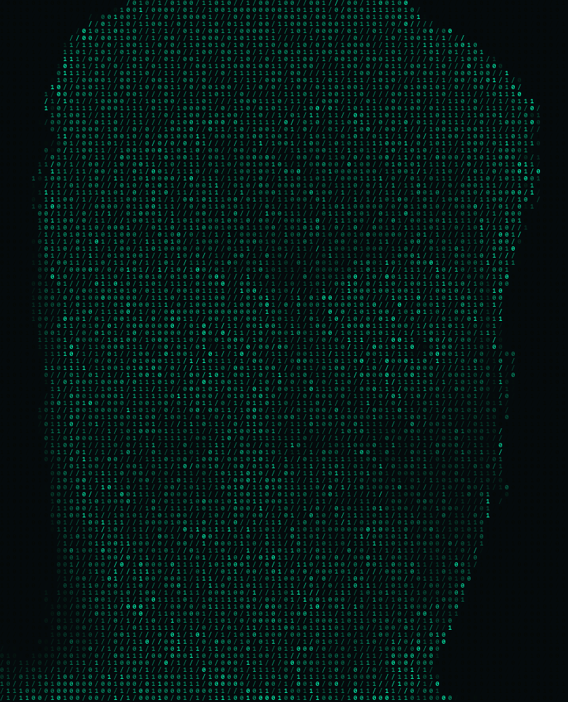

<div align="center">

# Piyush Mani Tripathi

`> building systems, preserving code, and finding the signal in the noise.`

</div>

<table>
  <tr>
    <td width="42%" valign="top">
      
    </td>
    <td width="58%" valign="top">

```text
$ whoami
username   : thenectartrips
name       : Piyush Mani Tripathi

$ system --info
os         : Windows 11 · Linux · Android 17
ide        : VS Code 1.129 · Python 3.12.10

$ languages --programming
Python · C · Java · JavaScript

$ languages --computer
HTML · CSS · JSON · YAML

$ languages --human
Hindi · English

$ interests --list
software   : Open Source Archaeology · Homelab Building
hardware   : Overclocking · Undervolting
```

<a href="mailto:prashambik2004@gmail.com"></a>
<a href="https://github.com/thenectartrips"></a>
<a href="https://instagram.com/thenectartrips"></a>

LinkedIn: **Piyush Mani Tripathi**

  </td>
  </tr>
</table>

<div align="center">

## GitHub stats

<a href="https://github.com/thenectartrips">
  
</a>
<a href="https://github.com/thenectartrips">
  
</a>


</div>

---

<div align="center">
  <sub>Rendered from a field of <code>0</code>, <code>1</code>, and <code>/</code>.</sub>
</div>
